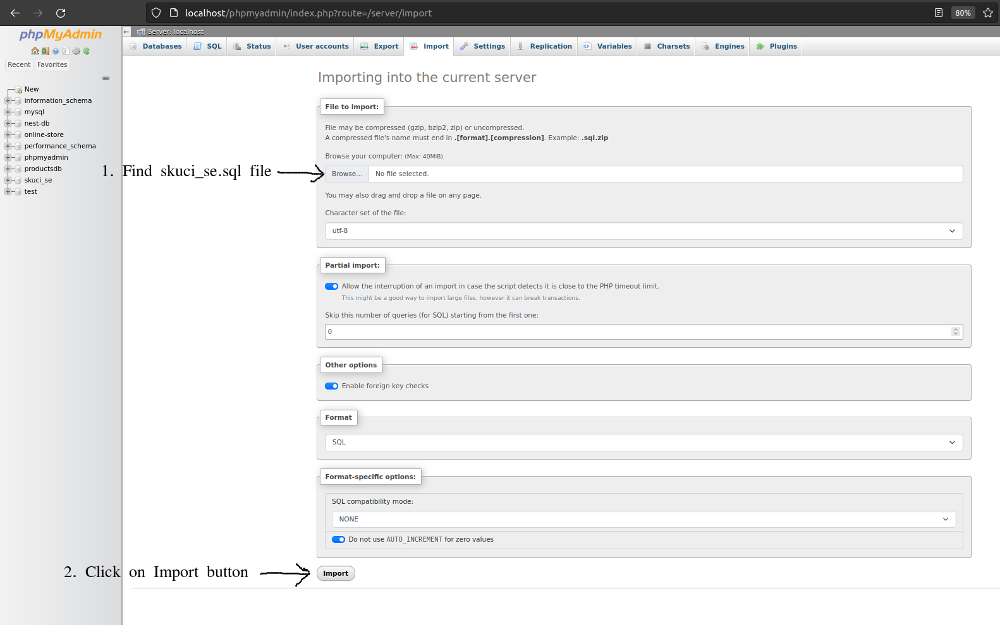

# Start server

## Before start server import database

> Go to `server/src/main/resources/database` and import `skuci_se.sql` in phpmyadmin.  
> 
> 
> 

Install `Run Java` and other Java extensions in VSCode.  
Open `server` directory in VSCode and run it.

# Start docs server

```sh
cd api-docs
npm install
npm start
```
Server is running on port 8888.

# Start client

```sh
cd client
npm install
npm start
```
Client is running on port 4200.